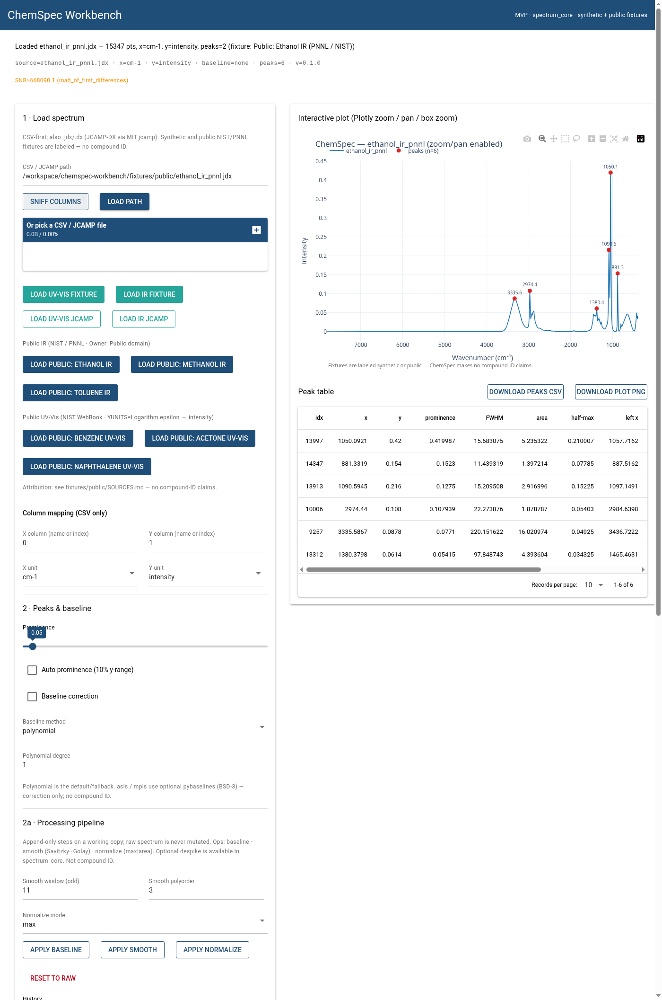

# ChemSpec Workbench

**Primary product: ChemSpec** — software-only workbench for **UV-Vis / IR** spectra:
open CSV/JCAMP, plot, find peaks (center, height, prominence, **FWHM**, **area** with an
explicit prominence-relative measurement contract), correct a simple baseline,
overlay/stack traces, export peaks, A↔%T display, folder waterfall,
**processing pipeline** (baseline / smooth / normalize / despike + step history), and
**analysis session** save/load (`.csw.json` with `raw_data_hash` / `analysis_fingerprint`).
Built on a reusable `spectrum_core` package (Spectrum Family).

### Experimental siblings (not the primary product)

| App | Label | What it is today |
|-----|-------|------------------|
| **LabRF Monitor** (`labrf/`) | **Experimental** | Receive-only RF power spectrum + waterfall from **mock IQ** (CI/UI default) or optional RTL-SDR. Educational EMI awareness — **not** chemical ID, **not** regulatory advice, **no transmit**. |
| **TeachSpec** (`teachspec/`) | **Experimental** | Phase-0 educational optical stub (mock frames + pixel→nm calibration → `Spectrum`). **v1 sensor locked:** USB camera (UVC) primary; live UVC ingest **not** Implemented; **not** hardware-verified. |

**Honesty:** ChemSpec does **not** identify compounds or drive spectrometers.
LabRF mock mode does **not** claim live RF until STATUS says hardware-verified.
TeachSpec mock frames are **not** live camera captures and do **not** claim hardware-verified wavelength. USB-cam (UVC) is the documented v1 primary sensor; see `docs/family/teachspec/SAFETY.md` + `BOM_v0.md`.
Synthetic fixtures are labeled as synthetic; public NIST/PNNL IR (Owner: Public domain) and NIST UV-Vis (log ε; INEP CP RAS / NIST OSRD) fixtures live in `fixtures/public/` with attribution in `SOURCES.md` — still no compound-ID claims. Public UV-Vis y is log₁₀(ε) → **intensity**, **not** absorbance.

## Install / Developer setup

Fresh checkout (matches CI — includes `jcamp` from main deps plus pytest / UI / baselines):

```bash
cd chemspec-workbench
python -m venv .venv
source .venv/bin/activate   # Windows: .venv\Scripts\activate
pip install -e ".[dev,ui,baselines]"
pytest -q
```

Or mirror CI with Make / script:

```bash
make test
# or: ./scripts/ci-test.sh
```

Minimal install (core + pytest only):

```bash
pip install -e ".[dev]"
```

Optional extras:

```bash
pip install -e ".[baselines]"          # pybaselines (BSD-3); also in [dev]
pip install -e ".[ui]"                 # NiceGUI + Plotly
pip install -e ".[ui,baselines]"
pip install -e ".[labrf]"              # optional pyrtlsdr (hardware not required for CI)
```

`jcamp` is a **required** dependency (not optional) so JCAMP ingest and public IR/UV-Vis fixture tests work after a clean install.

## Quick demo (showable in ~5 minutes)

Honest MVP walkthrough — **analysis / visualization only**, not compound ID.
LabRF steps use **mock IQ** (educational EMI awareness; no dongle, no TX).

```bash
cd chemspec-workbench
python -m venv .venv && source .venv/bin/activate
pip install -e ".[dev,ui,baselines]"
pytest -q   # expect green before demos
```

**ChemSpec UI — public ethanol IR**

```bash
python -m chemspec.ui_app   # http://localhost:8080
```

1. Click **Load public: Ethanol IR** (PNNL/NIST JCAMP in `fixtures/public/`)
   or **Load public: Benzene / Acetone / Naphthalene UV-Vis** (NIST WebBook;
   y is log₁₀(ε) → intensity, **not** absorbance — A↔%T stays blocked with an explicit warn).
2. Optional: turn on baseline, tweak prominence, note FWHM/area in the peak table.
3. Optional: **Export peaks CSV / plot PNG** or save a `.csw.json` analysis session.
4. **Folder waterfall:** click **Demo waterfall fixture** (or Load folder → `fixtures/waterfall/`)
   for three synthetic UV-Vis CSVs stacked with y-offsets.

Attribution: [`fixtures/public/SOURCES.md`](fixtures/public/SOURCES.md).
Synthetic waterfall files are **not** real compounds.

**LabRF Monitor — mock stream (no hardware)**

```bash
python -m labrf.ui_app   # http://localhost:8081
python -m teachspec.demo  # or: teachspec-demo — synthetic optical peaks (no camera)
```

1. Read the dismissible disclaimer card (educational presets ≠ regulatory advice).
2. Click **Start stream** — spectrum + waterfall update from synthetic IQ.
3. Try a quick preset (FM / ISM / …); optionally set a power threshold and export events CSV.

**MVP limits (do not oversell):** ChemSpec does **not** identify compounds or drive
spectrometers. LabRF mock mode is **not** live RF until STATUS says hardware-verified.
Folder waterfall is stack offsets only (sort by name/mtime) — no true time-axis metadata.



*ChemSpec UI with the public PNNL/NIST ethanol IR JCAMP loaded (analysis / visualization only — **not** compound identification). Peak table shows geometric FWHM/area; y is intensity as ingested. Optional UV-Vis public fixtures (benzene / acetone / naphthalene) use log₁₀(ε) → intensity, not absorbance.*

Capture locally: `python scripts/capture_chemspec_screenshot.py` (needs `[ui]` + selenium + Chrome).

## ChemSpec interactive UI (NiceGUI)

```bash
pip install -e ".[ui]"
python -m chemspec.ui_app
# or: chemspec-ui
```

Then open **http://localhost:8080**.

The amber **measurement diagnostics** strip (SNR + peak/baseline advisories) is
**heuristic / advisory only**. SNR uses MAD of first differences; on dense,
smooth library IR (e.g. public PNNL JCAMP) the numeric value can read very high
— not an LOD or instrument-qualification claim. See
`spectrum_core.diagnostics` and `docs/AUDIT_spectrum_core.md`.

## LabRF Monitor (mock IQ UI — no dongle)

```bash
pip install -e ".[ui]"
python -m labrf.ui_app
# or: python -m labrf
# or: labrf-ui
```

Then open **http://localhost:8081**.

**Demo tips (showable without hardware):**

1. Click **Start stream** — spectrum + waterfall update continuously from synthetic IQ.
2. Use **quick preset** buttons (FM / ISM / …) to jump center/span.
3. Set a **power threshold (dB)**; events appear in the log when peaks/max bin exceed it;
   **Export events CSV** / **Clear events** as needed.
4. **Load mock fixture** for a one-click synthetic capture from `fixtures/labrf/mock_iq.npz`.
5. Provenance line shows source (mock/fixture), center, rate, frames, streaming mode.

- Educational presets with disclaimer banner (not regulatory advice)
- Live RTL-SDR only if `pip install -e ".[labrf]"` **and** a dongle is present
  (not required for tests or the mock UI)

## Test

```bash
pip install -e ".[dev,ui,baselines]"   # same extras as CI
pytest -q
# or: make test
```

ChemSpec tests (CSV/JCAMP/public fixtures) and LabRF mock tests (no dongle) should both pass.
GitHub Actions (`.github/workflows/ci.yml`) runs the same install + `pip-audit` + `pytest -q` on Python 3.11 and 3.13 for every push/PR to `main`.
License: MIT (`LICENSE`). Dependency updates: Dependabot (`.github/dependabot.yml`, weekly pip + github-actions).

## Run ChemSpec demos (no UI)

```bash
python -m chemspec.demo
python chemspec/plot_demo.py --fixture ir --save ir_demo.png --no-show
```

## Examples / Tutorials

Short walkthroughs (matplotlib; NiceGUI not required):

| Path | Notes |
|------|--------|
| [`examples/ethanol_ir_walkthrough.ipynb`](examples/ethanol_ir_walkthrough.ipynb) | ~5–10 min public ethanol IR JCAMP → baseline/smooth → peaks (FWHM/area) → optional CSV/session |
| [`examples/ethanol_ir_walkthrough.py`](examples/ethanol_ir_walkthrough.py) | Headless twin of the notebook |
| [`examples/benzene_uvvis_walkthrough.ipynb`](examples/benzene_uvvis_walkthrough.ipynb) | ~5–10 min public NIST benzene UV-Vis JCAMP → log₁₀(ε) intensity plot (**not** A) → baseline/smooth → peaks → optional CSV/session |
| [`examples/benzene_uvvis_walkthrough.py`](examples/benzene_uvvis_walkthrough.py) | Headless twin of the notebook |
| [`examples/acetone_uvvis_walkthrough.ipynb`](examples/acetone_uvvis_walkthrough.ipynb) | ~5–10 min public NIST acetone UV-Vis JCAMP → log₁₀(ε) intensity plot (**not** A) → baseline/smooth → peaks → optional CSV/session |
| [`examples/acetone_uvvis_walkthrough.py`](examples/acetone_uvvis_walkthrough.py) | Headless twin of the notebook |
| [`examples/naphthalene_uvvis_walkthrough.ipynb`](examples/naphthalene_uvvis_walkthrough.ipynb) | ~5–10 min public NIST naphthalene UV-Vis JCAMP → log₁₀(ε) intensity plot (**not** A) → baseline/smooth → peaks → optional CSV/session |
| [`examples/naphthalene_uvvis_walkthrough.py`](examples/naphthalene_uvvis_walkthrough.py) | Headless twin of the notebook |

```bash
pip install -e ".[dev,ui,baselines]"
python examples/ethanol_ir_walkthrough.py
python examples/benzene_uvvis_walkthrough.py
python examples/acetone_uvvis_walkthrough.py
python examples/naphthalene_uvvis_walkthrough.py
# or open examples/ethanol_ir_walkthrough.ipynb / benzene_uvvis_walkthrough.ipynb / acetone_uvvis_walkthrough.ipynb / naphthalene_uvvis_walkthrough.ipynb
```

See [`examples/README.md`](examples/README.md). Analysis path only — **no compound identification**.
Attribution for the public fixture: [`fixtures/public/SOURCES.md`](fixtures/public/SOURCES.md).


## Folder waterfall (multi-file)

Load a directory of CSV / JCAMP spectra into a **stacked** (waterfall-style) view.
Shared `x_unit` is required; y-offsets are display offsets only (not a time axis).

**Fixture demo folder:** [`fixtures/waterfall/`](fixtures/waterfall/) — three synthetic
UV-Vis absorbance CSVs (`t00`…`t02`). See [`fixtures/waterfall/README.md`](fixtures/waterfall/README.md).

**From Python:**

```python
from spectrum_core import folder_waterfall, ingest_folder, list_spectrum_files

paths = list_spectrum_files("fixtures/waterfall")
raw = ingest_folder(
    "fixtures/waterfall",
    x_col="wavelength_nm",
    y_col="absorbance",
    x_unit="nm",
    y_unit="A",
)
stacked = folder_waterfall(
    "fixtures/waterfall",
    x_col="wavelength_nm",
    y_col="absorbance",
    x_unit="nm",
    y_unit="A",
    offset=1.0,  # y offset between traces
)
# stacked[i].meta["stack_offset"] == i * offset
```

**From ChemSpec NiceGUI:** section **4 · Folder waterfall** — enter a folder path and
**Load folder**, or one-click **Demo waterfall fixture**. **Clear waterfall** keeps the
primary spectrum. Matching `x_unit` is enforced (mixed UV-Vis nm + IR cm⁻¹ fails).
Optional **3-D surface** checkbox (`state.view_3d`) — series index ≠ time; see
[`docs/viz3d.md`](docs/viz3d.md).

Headless plot without UI: `python chemspec/plot_demo.py --fixture ir --save ir_demo.png --no-show`
(single-file; use the Python API above for multi-file stack).

## Processing pipeline

`spectrum_core.processing` keeps a **raw** spectrum separate from a **working** copy
and an append-only **history** of steps (`name`, `params`, `timestamp`, `software_note`):

| Op | Notes |
|----|--------|
| `baseline` | Reuses `baseline_correct` (polynomial / optional asls/mpls) |
| `smooth` | Savitzky–Golay (`scipy.signal.savgol_filter`) |
| `despike` | Optional local median / z-score style spike replace (teaching aid) |
| `normalize` | Optional `max` (÷ peak \|y\|) or `area` (÷ ∫\|y\| dx) |

```python
from spectrum_core import ingest, apply_step, replay_history, save_session

raw = ingest("sample.csv")
working, history = apply_step(raw, None, "smooth", {"window_length": 11, "polyorder": 3})
working, history = apply_step(working, history, "normalize", {"mode": "max"})
save_session("analysis.csw.json", raw, history=history)  # stores raw + history
loaded = ...  # load_session → replay_history(loaded.spectrum, loaded.history)
```

NiceGUI (**2a · Processing pipeline**): history list, Apply baseline / smooth / normalize, Reset to raw.

## Analysis sessions

Save a reproducible analysis snapshot from the NiceGUI UI (**2b · Analysis session**)
or from Python:

```python
from spectrum_core import ingest, find_peaks, save_session, load_session

spec = ingest("sample.csv")
peaks = find_peaks(spec, prominence=0.15)
save_session(
    "analysis.csw.json",
    spec,
    processing={"baseline_on": True, "baseline_method": "polynomial", "baseline_degree": 1},
    peaks=peaks,
    notes="optional lab notes",
    source_path="sample.csv",
)
session = load_session("analysis.csw.json")  # embedded x/y — path may have moved
```

File extensions: `.csw.json` or `.chemspec.json`. Schema is documented in `SPEC.md`
(`format_version`, embedded raw spectrum, processing, pipeline history, peaks, notes, provenance).
Sessions are analysis snapshots — **not** compound identification.

## Layout

| Path | Role |
|------|------|
| `spectrum_core/` | Shared Spectrum model (optical + RF units), CSV/JCAMP ingest, peaks (FWHM/area), baseline, overlay/stack, folder waterfall, **session save/load** |
| `chemspec/` | UV-Vis/IR demos + NiceGUI MVP |
| `labrf/` | LabRF Monitor: mock IQ, FFT→spectrum, stream generator, threshold events, waterfall, presets, optional RTL-SDR stub, NiceGUI UI |
| `teachspec/` | TeachSpec Phase-0 stub: pixel→nm calibration, OpticalLiveFrame→Spectrum, synthetic mock frames (no camera) |
| `fixtures/` | Synthetic UV-Vis/IR + `public/` (NIST/PNNL IR + NIST UV-Vis) + `waterfall/` + `labrf/mock_iq.npz` |
| `examples/` | Tutorials (ethanol IR + benzene/acetone/naphthalene UV-Vis walkthrough notebook + script twins) |
| `tests/` | pytest (ChemSpec + LabRF + TeachSpec mock; no hardware) |
| `docs/family/` | Per-app Truth / SPEC / roadmap / status |

## Docs

- `PROJECT_TRUTH.md` / `SPEC.md` / `ROADMAP.md` / `STATUS.md` — ChemSpec
- `docs/family/labrf-monitor/` — LabRF Truth / SPEC / roadmap / status
- `docs/family/teachspec/` — TeachSpec Truth / SPEC / SAFETY / BOM_v0 / roadmap / status (Phase-0 software stub; USB-cam primary locked)
- `AGENTS.md` — hard rules (incl. receive-only LabRF, no chem ID, educational presets)
- `examples/README.md` — tutorial index (ethanol IR + benzene/acetone/naphthalene UV-Vis walkthroughs)
- `fixtures/waterfall/README.md` — synthetic multi-file waterfall demo folder
- `fixtures/public/SOURCES.md` — NIST/PNNL public IR + NIST UV-Vis attribution

## Non-goals

Hardware drivers for ChemSpec; compound libraries / ID claims; LabRF demodulation, TX,
compliance certification, or chemical ID via RF.
